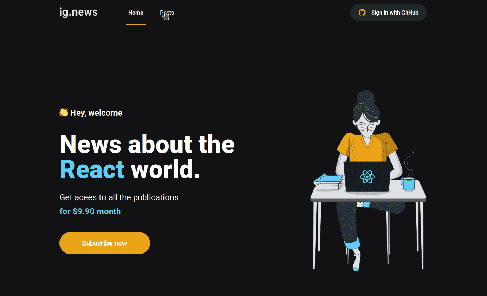

  <h1 align="center">
    
    <br>
</h1>

<p align="center">
  <a href="https://www.linkedin.com/in/roger-fernandes-1488841b9/">
    
  </a>

  <a href="./LICENSE">
    
  </a>
</p>

<h4 align="center">
  This is the third project on the ReactJS track from the <a href="https://github.com/Rocketseat/">Rocketseat </a> Ignite bootcamp.
</h4>


<p align="center">
  <a href="#ledger-about">About</a>&nbsp;&nbsp;&nbsp;|&nbsp;&nbsp;&nbsp;
  <a href="#running-starting">Starting</a>&nbsp;&nbsp;&nbsp;|&nbsp;&nbsp;&nbsp;
  <a href="#computer-technologies">Technologies</a>&nbsp;&nbsp;&nbsp;|&nbsp;&nbsp;&nbsp;
  <a href="#memo-license">License</a>
</p>



## :ledger: About
It is an application that simulates a blog post created by prismic CMS.With the following features:

- Log in with github
- Signature by Stripe
- Post list by Prismic


## :running: Starting

Before starting :checkered_flag:, you need to have installed:
- [Git](https://git-scm.com)
- [Node](https://nodejs.org/en/)
- [Yarn](https://classic.yarnpkg.com/en/)
- [Stripe CLI](https://stripe.com/docs/stripe-cli)

```bash
# Clone this project
$ git clone https://github.com/rogeraf15/ignews

# Access
$ cd ignews

# Install dependencies
$ yarn

# Copy the example and fill in the .env.local with your credentials
$ cp .env.example .env.local

# Run stipen listener
$ stripe listen --forward-to localhost:3000/api/webhooks

# Run the project
$ yarn dev

# The server will initialize in the <http://localhost:3000>
```

## :computer: Technologies

- [NextJS](https://nextjs.org/)
- [PrimiscCMS](https://prismic.io/)
- [Typescript](https://www.typescriptlang.org/)
- [Axios](https://axios-http.com/)
- [FaunaDB](https://fauna.com/)
- [NextAuth](https://next-auth.js.org/)
- [PrismicCMS](https://prismic.io/)
- [Stripe](https://stripe.com/br)
- [Sass](https://sass-lang.com/)
- [Jest](https://jestjs.io/pt-BR/)
- [Testing Library](https://testing-library.com/)


## :memo: License

This project is under the MIT license. See the [LICENSE](./LICENSE) for more information.

---

Made with ♥ by Roger Fernandes :wave: [Get in touch!](https://www.linkedin.com/in/roger-fernandes-1488841b9/)

